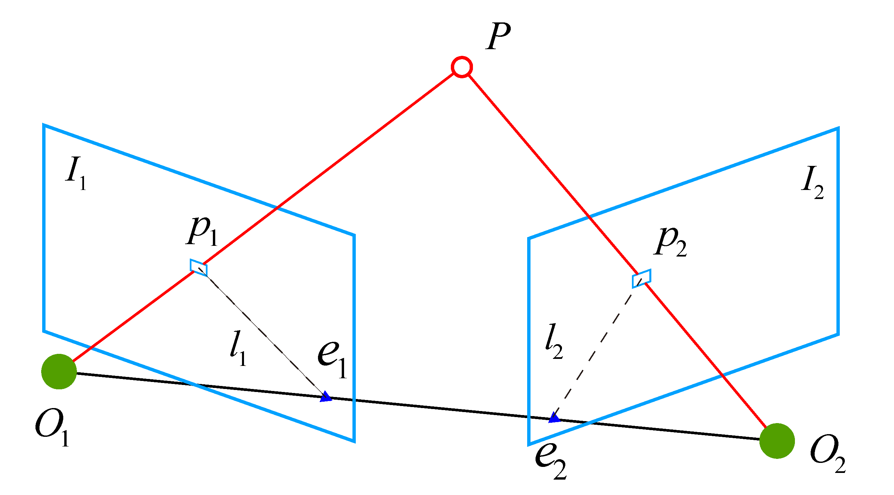
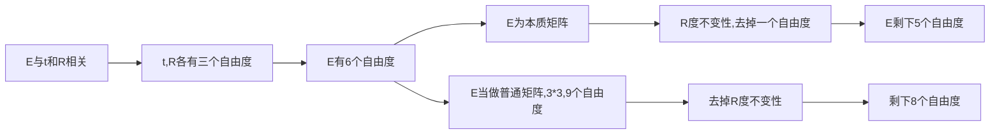
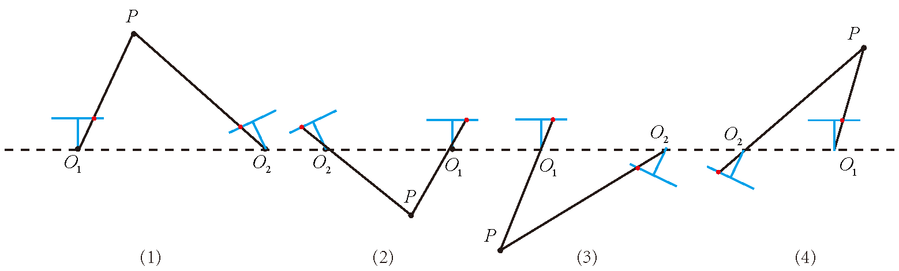
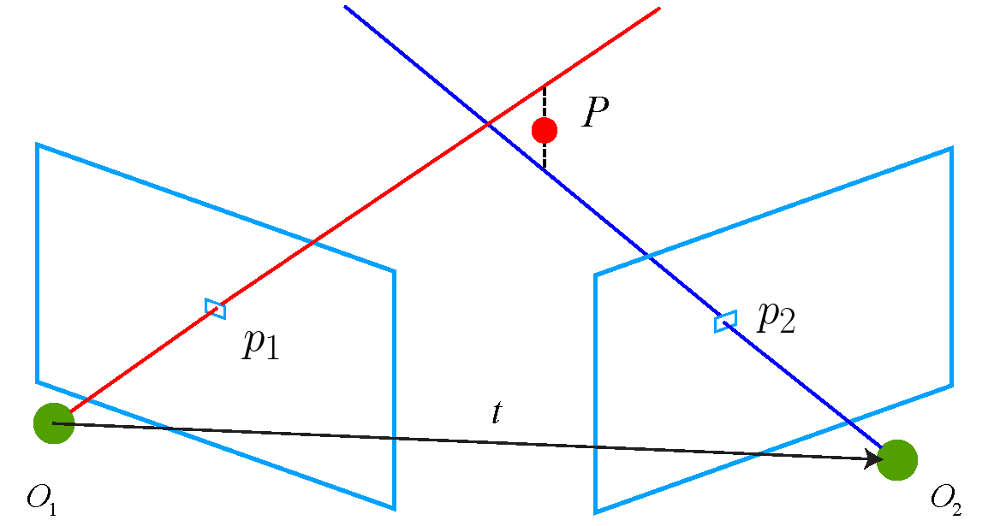
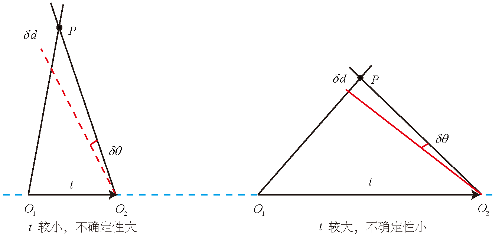
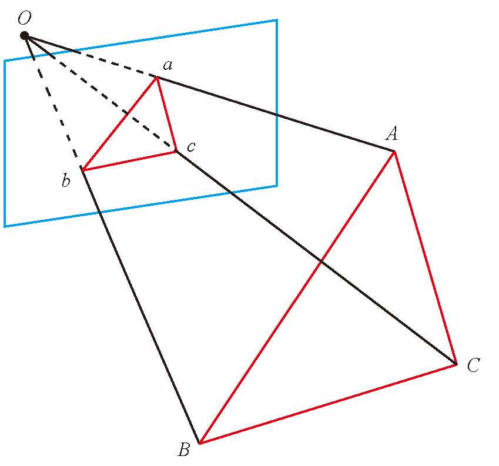

# 第七讲: 视觉里程计1

## 特征点法

slam分为`视觉前端`和`视觉后端`.前端也称为视觉里程计(VO). 它根据相邻图像的信息粗略估计相机的运动,给后端提供较好的初始值.

本讲学习如果提取匹配特征点,然后估计两帧之间的相机运动和场景结构.

### 特征点

图像本身是由`亮度`和`色彩`组成的矩阵.

特征点:

- 朴素角点: 简单,受环境,相机旋转等影响.
- 人工设计的特征点: 可重复性,可区别性,高效率性,本地性.

特征点是由关键点和描述子组成:

- 关键点: 图像中的位置
- 描述子: 附加信息,为了更好的区别其他点.

描述子通常是一个向量,按照某种认为设计的方式,描述了该关键点周围像素的信息.设计原则: **外观相似的特征应该有相似的描述子.**

ORB(Oriented FAST and Rotated BRIEF) 是目前非常具有代表性的实时图像特征.

ORB是质量与性能较好的折中.

### ORB特征

ORB由`关键点`和`描述子`组成.

关键点称为: Oriented FAST.是一种改进的FAST角点.

描述子称为: BRIEF(Binary Robust Independent Elementary Feature).

提取ORB特征点的步骤为:
- FAST角点提取: 找出图像中的角点. 相较于原版FAST,ORB中计算了特征点的主方向,为后续的BRIEF描述子增加了旋转不变性.
- BRIEF描述子: 对前一步中的特征点的周围进行描述.

**FAST 关键点**

FAST是一种角点,主要检测局部像素灰度变化明显的地方.特点是速度快.

$$
FAST特征点:
\begin{cases}
	优点: 仅比较像素间亮度的差异速度快 \\
	缺点:
	\begin{cases}
		特征点很多且不确定-决绝方法:指定要提取的角点数N,选取前N个具有最大响应值的点作为最终角点的集合 \\
		不具有方向信息-决绝方法: 添加旋转描述,其特征的旋转由灰度实心法实现 \\
		存在尺度问题-决绝方法: 添加尺度描述,尺度不变性由构建图像金字塔,并在金字塔每层检验角点来实现.
	\end{cases}
\end{cases}
$$

`质心`:图像块灰度值作为质心.

操作步骤如下:

1. 在一个小的图像块B中,定义图像块的矩阵为: 

$$
m_{pq} = \sum_{x,y \in B}x^py^qI(x,y),\qquad p,q=\{0,1\}
$$

2. 通过矩可以找到图像块的质心

$$
C = (\frac{m_{10}}{m_{00}},\frac{m_{01}}{m_{00}})
$$

3. 连接图形块的几何中心O与质心C, 得到一个方向向量$\overrightarrow{OC}$,于是特征点的方向可以定义为:

$$
\theta = \arctan(\frac{m_{01}}{m_{10}})
$$

通过以上信息,FAST便具有了`尺度`与`旋转`的描述.提升了健壮性. 在ORB中把这种改进后的FAST称为:Oriented FAST.

**BRIEF描述子**

提取关键点后对每个点计算其描述子.

BRIEF是一种`二进制描述子`. 例如,取关键点附近的p和q,如果p比q大,则取1,否则取0,如果去了128对这样的点,那么描述子可以用一个128位的二进制数来表示.

与原始的BRIEF相比,ORB描述子具有良好的旋转不变性.

### 特征匹配

特征匹配解决了SLAM中数据关联问题,即确定当前看到的路标与之前看到的路标之间的对于关系.

通过对图像与图像之间或者图像与地图之间的描述进行准确匹配,我们可以为后续姿态估计,优化等操作减轻大量负担.

如何两个图片中特征点集合的对应关系呢?
- 暴力匹配: 对每个特征点都测量描述子的距离,然后排序,取得最近的一个作为匹配点.

>描述子的距离,
>对于浮点型的描述子使用欧氏距离
>对于二进制类型的描述子使用汉明距离

- 快速近似最邻近匹配: 更适合与匹配点的情况.它已经集成到了opencv当中.

## 实践: 特征提取和匹配

目前主流的几种特征提速方法在OpenCV中已经集成.

以下为openCV中图像特征提取,计算和匹配的过程.

代码见:`code\第七讲`

我们希望根据匹配的点对来估计相机的运动.

1. 当相机为单目时,我们只知道2D的像素坐标,因而问题是根据两组2D点估计运动.该问题用`対极几何`来解决.
2. 当相机为双目,RGB等,即有距离信息. 那么就根据3D点估计运动. 常用`ICP`来解决.
3. 如果有3D点及在其他相机的投影位置,也能估计相机的运动. 该问题是通过`PnP`求解.

## 2D-2D:対极几何

### 对极约束

在第一帧的坐标系下,设P的空间位置为;
$$
P = [X,Y,Z]^T
$$

根据第五讲针孔相机模型,我们知道两个像素点$p_1,p_2$的像素位置为:
$$
s_1p_1 = KP , \quad s_2p_2 = K(RP+t)
$$

K为相机的内参矩阵. $R,t$为相机的运动,也可以写成李代数的形式.

如果使用齐次坐标,那么上式也可以写成如下形式;
$$
p_1 = KP , \quad p_2 = K(RP+t)
$$

取:
$$
x_1 = K^{-1}p_1, \quad x_2 = K^{-1}p_2 
$$

$x_1,x_2$是两个像素点 **归一化平面**的坐标.带入上式得:
$$
x_2 = Rx_1 + t
$$

两边同时左乘$t^\wedge$(^表示将向量变成矩阵),相当于两侧同时与t做外积:
$$
t^\wedge x_2 = t^\wedge Rx_1
$$

然后同时左乘$x_2^T$
$$
x_2^Tt^\wedge x_2 = x_2^T t^\wedge Rx_1
$$

因为$t^\wedge x_2 = 0$,所以上式化简为:
$$
x_2^Tt^\wedge R x_1 = 0
$$ 

重新带入$p_1,p_2$得:
$$
p_2^TK^{-T} t^\wedge RK^{-1} p_1 = 0
$$

以上两个式子都成为 **对极约束**.

它的几何意义是$O_1,P,O_2$三者共面. 対极约束中同时包含了 **平移和旋转**.

把中间部分记做两个矩阵: 
- F : 基础矩阵
- E : 本质矩阵

于是进一步简化対极约束;
$$
E = r^\wedge R , \quad F = K^{-T}EK^{-1}, \quad x_2^TEx_1 = p_2^TFp_1 = 0
$$

$対极约束简洁的给出了两个匹配点的空间位置关系.$ 于是相机的位姿估计可以分为以下步骤:
1. 根据匹配点的像素位置求出E 或者 F
2. 根据E或者F 求出 $R,t$

>由于E和F只相差了相机内参,所以往往使用更简洁的EK

### 本质矩阵

本质矩阵$E=t^\wedge R$. 它是一个$3\times 3$矩阵. 从E的构造方式看,有以下几点需要注意:
1. 本质矩阵由対极约束定义.由于対极约束是等式为0的,所以对E乘以任意非零常数, 対极约束仍然满足. 我们把这件事称为E在不同尺度下是等价的.
2. 根据$E=t^\wedge R$ ,课证明本质矩阵E的奇异值必定是$[\sigma,\sigma,0]^T$的形式. 这称为 $本质矩阵的内在性质.$
3. 平移加旋转共有6个自由度,所以 $t^\wedge R$共有6个自由度.但是由于 **尺度等价性**, 实际上只有5个自由度.

使用8点法求解E.

$$
\begin{bmatrix}
	u_1^1u_2^1 & u_1^1v_2^1 & u_1^1  & v_1^1u_2^1 & v_1^1v_2^1 & v_1^1 & u_2^1 & v_2^1 &1 \\
	u_1^2u_2^2 & u_1^2v_2^2 & u_1^2  & v_1^2u_2^2 & v_1^2v_2^2 & v_1^2 & u_2^2 & v_2^2 &1 \\
	\vdots & \vdots & \vdots & \vdots & \vdots  & \vdots & \vdots  & \vdots & \vdots \\
	u_1^8u_2^8 & u_1^8v_2^8 & u_1^8  & v_1^8u_2^8 & v_1^8v_2^8 & v_1^8 & u_2^8 & v_2^8 &1
\end{bmatrix}
\begin{bmatrix}
	e_1 \\ e_2 \\ e_3 \\ e_4 \\ e_5 \\ e_6 \\ e_7 \\ e_8 
\end{bmatrix} = 0
$$

一声个方程构成了线性方程组. 它的系数矩阵由特征点位置构成,大小为$8\times 9$. e位于该矩阵的零空间中. 如果系数矩阵的秩为8,那么零空间的维数为1,也就是e构成一条线. 

如果系数矩阵的秩为8,那么上述方程可以解得E的值.

接下来根据估计的本质矩阵E,恢复出相机运动R,t.这个过程由奇异值分解(SVD)得到.
$$
E = U \Sigma V^T
$$

>$U,V$为正交矩阵,$\Sigma$为奇异值矩阵. 
>根据E的内在性质,$\Sigma = diag(\sigma,\sigma,0)$

对于任意E,存在两个可能的$t,R$与之对应:
$$
t_1^\wedge = UR_Z(\frac{\pi}{2})\Sigma U^T, \quad R_1 = UR_Z^T(\frac{\pi}{2})V^Tt \newline
t_2^\wedge = UR_Z(-\frac{\pi}{2})\Sigma U^T, \quad R_2 = UR_Z^T(-\frac{\pi}{2})V^Tt
$$

>$R_Z(\frac{\pi}{2})$表示旋转90度的旋转矩阵. 同时,由于$-E 等价于 E$,所以任意一个t取负号,会得到同样的结果. 因此,从E分解得到$t,R$,一个存在4种结果.

如下图;

最后还有一个问题,线性方程组求解出E后,它可能不满足E的内在性质:奇异值不为$(\sigma, \sigma, 0)$ 的形式.
对8点大求得的E进行SVD分解后,会得到奇异值矩阵$\Sigma = diag(\sigma,\sigma,0)$.取($\sigma _1 \geqslant \sigma _2 \geqslant \sigma _3$):

$$
E = U diag(\frac{\sigma_1+\sigma_2}{2},\frac{\sigma_1+\sigma_2}{2},0)V^T
$$

>最简单的方法是将奇异值取$diag(1,1,0)$

### 单应矩阵

单应矩阵H:它描述了两个平面之间的映射关系.

单应矩阵通常扫描处于共平面上的一些点在两张图像之间的变换关系.

经过计算我们可以得到一个直接描述图像坐标$p_1$到$p_2$之间的变换,把中间部分记做H:
$$
p_2 = H p_1
$$

把上式展开:
$$
\begin{bmatrix}
	u_2 \\ v_2 \\ 1
\end{bmatrix}= 
\begin{bmatrix}
	h_1 & h_2 & h_3 \\
	h_4 & h_5 & h_6 \\
	h_7 & h_8 & h_9
\end{bmatrix}
\begin{bmatrix}
	u_1 \\ v_1  \\ 1
\end{bmatrix}
$$

在实际中通常乘以一个非零因子,使得$h_9 = 1$,于是有:
$$
u_2 = \frac{h_1u_1+h_2v_2+h_3}{h_7u_1+h_8v_1+h_9} \newline 
\quad\newline 
v_2 = \frac{h_4u_1+h_5v_1+h_6}{h_7u_1+h_8v_1+h_9}
$$

于是自由度为8的单应矩阵可以通过4对匹配特征点算出.即求解以下方程:
$$
\begin{pmatrix}
	u_1^1 & v_1^1 & 1 &0 & 0 & 0 & -u_1^1u_2^1 & -v_1^1u_2^1 \\
	0 & 0 & 0 & u_1^1 & v_1^1 & 1 & -u_1^1u_2^1 & -v_1^1u_2^1 \\
	u_1^2 & v_1^2 & 1 &0 & 0 & 0 & -u_1^2u_2^2 & -v_1^2u_2^2 \\
	0 & 0 & 0 & u_1^2 & v_1^2 & 1 & -u_1^2u_2^2 & -v_1^2u_2^2 \\
	u_1^3 & v_1^3 & 1 &0 & 0 & 0 & -u_1^3u_2^3 & -v_1^3u_2^3 \\
	0 & 0 & 0 & u_1^3 & v_1^3 & 1 & -u_1^3u_2^3 & -v_1^3u_2^3 \\
	u_1^4 & v_1^4 & 1 &0 & 0 & 0 & -u_1^4u_2^4 & -v_1^4u_2^4 \\
	0 & 0 & 0 & u_1^4 & v_1^4 & 1 & -u_1^4u_2^4 & -v_1^4u_2^4 \\
\end{pmatrix}
\begin{pmatrix}
	h_1 \\ h_2 \\ h_3 \\ h_4 \\ h_5 \\h_6 \\ h_7 \\ h_8
\end{pmatrix}= 
\begin{pmatrix}
	u_2^1 \\ v_2^1 \\ u_2^2 \\ v_2^2 \\ u_2^3 \\ v_2^3 \\ u_2^4 \\ v_2^4 \\ 
\end{pmatrix}
$$

通过解线性方程来求解H矩阵. 求出单应矩阵后需要对其分解,才能得到响应的旋转矩阵R和平移向量t.过程与本质矩阵类似.

>单应性的意义: 当特征点共面或者相机发生纯旋转时,基础矩阵的自由度下降,这被称为 **退化**. 为了避免退化现象造成的影响,通常我们会同时估计 **基础矩阵F**和 **单应矩阵H**,选择投影误差较小的那个作为最终的运动估计矩阵.

## 实践:対极约束求解相机运动

下面练习通过本质矩阵求解相机运动. 代码见`code/第七讲`

## 三角测量

在估计了相机的运动之后,我们接下来用相机的运动估计特征点的空间位置.

在单目SLAM中无法无法通过单张图片获取像素的深度信息,需要通过 **三角测量**来获取.

三角测量: 通过在两处观察同一个点的夹角,从而确定该点的距离.

考虑图像$I_1,I_2$,右图的变换矩阵为$T$. 相机光心为$O_1,O_2$. 理论上$O_1p_1与O_2p_2$相交与p点,但是由于噪声的存在,并不能相交.可以使用最小二乘法求解.

设$x_1,x_2$为连个特征点的归一化坐标,它们满足一下关系:
$$
s_1x_1= s_2Rx_2 +t
$$

>$s_1,s_2$表示两个特征点的深度.

对上式左乘$x_1^\wedge$:
$$
s_1x_1^\wedge x_1 = 0 = s_2x_1^\wedge Rx_2 +x_1^\wedge t
$$
可以求出$s_2$,进而求出$s_1$

## 实践:三角测量

### 三角测量代码

代码演示利用対极几何求解相机的位姿,通过三角化求出特征点的空间位置.

代码见`code/第七讲`.

### 讨论

纯旋转是无法使用三角测量的,因为対极约束将永远满足.

三角测量的不确定性
$$
三角测量的矛盾
\begin{cases}
	平移太大 \rightarrow 不确定性小  \rightarrow 虽然不确定性小,但是外观变化大,使得特征提取和匹配变得困难 \\
	平移太小 \rightarrow 不确定性大 \rightarrow 像素的不确定性导致深度不确定性
\end{cases}
$$

## 3D-2D:PnP

**PnP** (Perspective-n-Point):是求解3D到2D点对的运动方法.它描述了当知道了n个3D空间点及投影位置时,如何估计相机的位姿.

如果两张图中一张的特征点的3D位置已知,那么只需要3对特征点来估计相机的运动.

特征点的位置估计可以由 **三角化** 或 **RGB-D** 相机的深度图确定.

PnP有很多求解方法,例如: P3P,直接线性变化(DLT),EPnP,UPnP,非线性优化等.

### 直接线性优化(6对匹配点)

假设空间点$P = (X,Y,Z,1)^T$. 在图 $I_1$ 中投影特征点为: $x_1 = (u_1,v_1,1)^T$

相机的位姿$R,t$是未知的,定义一个增广矩阵表示平移和旋转:$[R|t]$,
$$
sx_1 = [R|t]P \quad \Rrightarrow \quad
s 
\begin{pmatrix}
	u_1 \\ v_1 \\ 1
\end{pmatrix} = 
\begin{pmatrix}
	t_1 & t_2 & t_3 & t_4 \\
	t_5 & t_6 & t_7 & t_8 \\
	t_9 & t_{10}& t_{11}& t_{12}
\end{pmatrix}
\begin{pmatrix}
	X\\Y\\Z \\1
\end{pmatrix}
$$

用最后一行把s消掉,得到:
$$
u_1 = \frac{t_1X+t_2Y+t_3Z +t_4}{t_9X+t_{10}Y+t_{11}Z+t_{12}} \newline
\quad \newline
u_1 = \frac{t_5X+t_6Y+t_7Z +t_8}{t_9X+t_{10}Y+t_{11}Z+t_{12}}
$$

我们定义$T=[R|t]$的行向量为:
$$
\bm{t_1}=(t_1,t_2,t_3,t_4)^T, \newline
\bm{t_2}=(t_5,t_6,t_7,t_8)^T, \newline
\bm{t_3}=(t_9,t_{10},t_{11},t_{12})^T, \newline
$$

于是约束关系可以简写成如下形式:
$$
t_1^TP - t_3^TPu_1 = 0 \newline
t_2^TP - t_3^TPv_1 = 0
$$

假设一共有N个特征点(不要忘了我们要求解的是T),可以列出如下的线性方程:
$$
\begin{pmatrix}
	P_1^T & 0 & -u_1P_1^T \\
	0 & P_1^T & -v_1P_1^T \\
	\vdots & \vdots & \vdots  \\
	P_N^T & 0 & -u_NP_N^T \\
	0 & P_N^T & -v_NP_N^T
\end{pmatrix}
\begin{pmatrix}
	t_1 \\ t_2 \\ t_3
\end{pmatrix} = 0
$$

>由于t有12维,所以至少6对匹配点可以求出t

>因为旋转矩阵$R \in SO(3)$,但是SLT求解的T并不一定满足该条件,所以对$T=[R^\prime|t]$中的$R^\prime$进行QR分解(相当与将结果从矩阵空间重新投影到SE(3)流上,转化成旋转和平移两部分).

### P3P(3对匹配点)

它的输入点为三对3D-2D,记3D点为$A,B,C$,2D点为$a,b,c$,另外还需要使用一对验证点D-d.

>$A,B,C$是世界坐标系中的坐标.

一旦3D点在相机坐标系下的坐标能够算出,那么就得到了3D-3D的对应点,即把PnP问题转化成了ICP问题.

三角形存在对应关系(相似):
$$
\Delta Oab - \Delta OAB , \quad \Delta Obc = \Delta OBC , \quad \Delta Oac = \Delta OAC
$$

根据余弦定理:
$$
OA^2 + OB^2 - 2OA \cdot OB \cdot \cos(a,b)=AB^2
$$

其他善恶三角形有类似性质.

对上式除以$OC^2$,并且记$x=OA/OC,y=OB/OC$,得:
$$
x^2 + y^2 -2xy\cos(a,b) = AB^2/OC^2 \newline
y^2 + 1^2 -2y\cos(b,c) = BC^2/OC^2  \newline
x^2 + 1^2 -2x\cos(a,c) = AC^2/OC^2 
$$

记:
$$
\begin{cases}
	v = AB^2/OC^2 \\
	u = BC^2/AB^2 \\
	w = AC^2/AB^2 
\end{cases}
\Rightarrow
\begin{cases}
	uv = BC^2/OC^2 \\
	wv = AC^2/OC^2
\end{cases}
$$

得:
$$
x^2 + y^2 -2xy\cos(a,b) = v\newline
y^2 + 1^2 -2y\cos(b,c) = uv  \newline
x^2 + 1^2 -2x\cos(a,c) = wv 
$$

把第一个式子中的$v$带入到后两个中,得:
$$
(1-u)y^2 - ux^2-\cos(b,c)y + 2uxy\cos(a,b) +1 =0 \newline
(1-w)x^2 - wy_2 -\cos(a,c)x + 2wxy\cos(a,b) +1 =0
$$

该组方程最多会得到4组解,可以用验证点来得到正确的解,得到$A,B,C$的在相机坐标系下的3D坐标,然后根据3D-3D对求得$R,t$.

P3P存在的问题:
1. 只利用了三组点,当配对点多于3组,利用不上多余的点.
2. 如果3D点或2D点受到噪声的影响,或者存在误匹配,则算法失效.

### Bundle adjustment

除了使用线性方法外,还可以把PnP问题构建成一个定义在李代数上的最小二乘问题.

前面的线性方法都是 **先求相机位姿,再求空间点位置** , 而非线性优化则是把他们都看成优化变量,放在一起优化.

在PnP中,Bundle Adjustment 问题是最小化 **重投影误差**问题. 

假设有n个三维空间点P及其投影p, 我们希望计算机位姿$R,t$,它的李代数表示,记为$\xi$. 

假设空间点坐标$\bm{P_i} = [X_i,Y_i,Z_i]^T$,投影的像素坐标为:$\bm{u_i} = [u_i,v_i]^T$,根据第五讲可得:
$$
s_i 
\begin{pmatrix}
	u_i \\ v_i \\ 1
\end{pmatrix} = K \exp(\xi^\wedge)
\begin{pmatrix}
	X_i \\ Y_i \\ Z_i \\ 1
\end{pmatrix}
$$

写成矩阵形式:
$$
s_i \bm{u_i} = \bm{K} \exp(\xi^\wedge)P_i
$$

由于相机的位姿未知以及噪声的存在,我们把误差求和构建最小二乘问题:
$$
\xi^* = \argmin \frac{1}{2} \sum_{i=1}{n} \| \bm{u_i} - \frac{1}{s_i} \bm{K} \exp(\xi^\wedge)\bm{P_i} \|_2^2
$$

该问题的误差项是像素坐标(观测到的投影坐标)与3D点按照当前估计位置进行投影得到的位置相比较得到的误差,所以称为 **重投影误差**

使用 李代数可以构建无约束的优化问题,很方便的通过高斯牛顿法,列文伯格-马夸尔特方法进行求解.

在求解之前我们需要每个误差项关于优化变量的导数,即 **线性化:**
$$
e(x+ \Delta x) \approx e(x) +J\Delta x
$$

>J的形式是关键所在.可以使用数值导数,但是如果能够推导出解析形式,则我们会优先考虑解析形式.

当e为像素坐标误差,x为相机位姿,J将是一个$2 \times 6$矩阵.

设$P^\prime$为P在相机坐标系下坐标,并且将其前三维取出:
$$
P^\prime = (exp(\xi^\wedge)P)_{1:3} = [X^\prime,Y^\prime,Z^\prime]^T
$$

那么,相机的投影模型相对于$P^\prime$:
$$
s\bm{u}=KP^\prime
$$
展开:
$$
\begin{bmatrix}
	su \\ sv \\s
\end{bmatrix}= 
\begin{bmatrix}
	f_x & 0 & c_x \\
	0 & f_y & c_y \\
	0 & 0 & 1
\end{bmatrix}
\begin{bmatrix}
	X^\prime \\ Y^\prime \\ Z^\prime
\end{bmatrix}
$$

利用第三行消去s,得:
$$
u = f_x \frac{X^\prime}{Z^\prime} + c_x, \quad v=f_y \frac{Y^\prime}{Z^\prime}+c_y
$$

求误差时,可以把$u,v$与实际测量值比较,求差.

定义了中间变量之后,对$\xi^\wedge$左乘扰动量$\delta\xi$,然后考虑$e$的变化关于扰动量的导数.利于链式法则:
$$
\frac{\partial e}{\partial \delta\xi} = \lim_{\delta\xi \to 0} \frac{e(\delta\xi \oplus \xi )}{\delta\xi} = \frac{\partial e}{\partial P^\prime}\frac{\partial P^\prime}{\partial\delta\xi}
$$

>$\oplus$表示李代数上左乘扰动.

第一项是误差关于投影点的导数.
$$
 \frac{\partial e}{\partial P^\prime} = -
 \begin{bmatrix}
	 \frac{\partial u}{\partial X^\prime} & \frac{\partial u}{\partial Y^\prime} &\frac{\partial u}{\partial Z^\prime} \\
	 \frac{\partial v}{\partial X^\prime} & \frac{\partial v}{\partial Y^\prime} &\frac{\partial v}{\partial Z^\prime} 
 \end{bmatrix} = -
 \begin{bmatrix}
	 \frac{f_x}{Z^\prime} & 0 & -\frac{f_xX^\prime}{Z^{\prime 2}} \\
	 0 & \frac{f_y}{Z^\prime} & -\frac{f_yY^\prime}{Z^{\prime 2}}
 \end{bmatrix}
$$

第二项为变换后的点关于李代数的导数:
$$
\frac{\partial P^\prime}{\partial\delta\xi} = \frac{\partial (TP)}{\partial\delta\xi}=(TP)^\odot =
\begin{bmatrix}
	I & -P^{\prime \wedge} \\
	0^T & 0^T
\end{bmatrix}
$$

取前三维:
$$
\frac{\partial P^\prime}{\partial\delta\xi} =
\begin{bmatrix}
	I & -P^{\prime \wedge}
\end{bmatrix} 
$$

两式相乘可以得到一个$2\times 6$的雅克比矩阵:
$$
\frac{\partial e}{\partial \delta \xi} = -
\begin{bmatrix}
	\frac{f_x}{Z^\prime} & 0 & -\frac{f_xX^\prime}{Z^{\prime 2}} & -\frac{f_xX^\prime Y^{\prime}}{Z^{\prime 2}} & f_x +\frac{f_xX^2}{Z^{\prime 2}} & -\frac{f_xY^\prime}{Z^{\prime}} \\
	0 & \frac{f_y}{Z^\prime} & -\frac{f_yY^\prime}{Z^{\prime 2}} & -f_y - \frac{f_yY^{\prime 2}}{Z^{\prime 2}} & \frac{f_yX^{\prime}Y^\prime}{Z^{\prime 2}} & \frac{f_yX^\prime}{Z^{\prime}}
\end{bmatrix}
$$

这个雅克比矩阵描述了 **重投影误差**关于 **相机位姿李代数** 的一阶变化关系.

>前面的负号由于`误差`是由 **观测值减预测值**定义的, 如果是预测值减观测值,那么可以不加负号, 
>如果$\frak{se}(3)$ 定义方式是旋转在前,平移在后,那么只需要把前三列与后三列置换

除了优化位姿,还希望优化空间点位置,因此需要讨论e关于空间点P的导数:
$$
\frac{\partial e }{\partial P} = \frac{\partial e}{\partial P^\prime}\frac{\partial P^\prime}{\partial P}
$$

因为:
$$
P^\prime = \exp(\xi^\wedge)P = RP +t
$$

所以:
$$
\frac{\partial e }{\partial P} = -
\begin{bmatrix}
	\frac{f_x}{Z^\prime} & 0 & - \frac{f_xX^\prime}{Z^{\prime 2}} \\
	0 & \frac{f_y}{Z^\prime} & -\frac{f_yY^\prime}{Z^{\prime 2}}
\end{bmatrix} R
$$

现在我们有了 **观测相机方程**关于 **相机位姿** 与 **特征点** 的两个导数矩阵.他们能够在优化过程中提供梯度方向.

## 实践:求解UPnP

### 使用ePnP求解

使用openCV提供的EPnP求解PnP问题,然后通过g2o对计算结果进行优化.

代码见`code/第七讲/`

### 使用BA优化

BA(Bundle Adjustment)

可以使用Ceres或g2o库实现优化.

## 3D-3D:ICP

假设有一组匹配好的3D点:
$$
P = \{p_1,\dotsb , p_n\}, \quad P^\prime = \{ p_1^\prime,\dotsb , p_n^\prime \}
$$

现在需要欧式变换$R,t$,使得:
$$
\forall i,p_i = Rp_i^\prime +t 
$$

这个问题可以用迭代最近点来求解(ICP,Iterative Closest Point).
>仅考虑两组3D点时和相机并没有关系. 因此,在激光SLAM中也会碰到ICP,不过由于激光数据特征不够丰富,我们无法知道两个点集之间的匹配关系,只能认为距离最近的两个点为同一个点,所以这个方法称为迭代最近点.

>ICP的求解也分为两种方式:利用线性代数求解(SVD),以及利用非线性优化方式求解(BA).

### SVD

根据上一节中的ICP问题,我们定义第i对点的误差项为:
$$
e_i = p_i - (Rp_i^\prime + t)
$$

然后,构建最小二乘问题,求使误差平方和达到极小的$R,t$
$$
\min_{R,t} J = \frac{1}{2} \sum_{i=1}^n\|p_i-(Rp_i^\prime + t))\|_2^2
$$

定义两组点的质心:
$$
p=\frac{1}{2} \sum_{i=1}^{n} (p_i), \quad p^\prime = \frac{1}{n}\sum_{i=1}^n(p_i^\prime)
$$
... 推到过程略

优化目标函数可以简化为:
$$
\min_{R,t} J = \frac{1}{2} \sum_{i=1}^n \|p_i - p - R(p_i^\prime - p^\prime)\|^2 +\|p-Rp^\prime -t\|^2
$$

>观察发现左右两项中,左边只有R,右边有R,t,但是只和质心相关. 只要计算出R,令第二项为0就可以计算出t.

ICP可以分为以下三个步骤:

1. 计算两组点的质心$p,p^\prime$,然后计算每个点的去质心坐标: p

	$$
	q_i = p_i = p, \quad q_i^\prime = p_i^\prime - p^\prime
	$$
2. 根据以下的优化问题计算旋转矩阵:
	$$
	R^* = \arg \min_R \frac{1}{2} \sum_{i=1}^n \|p_i - Rq_i^\prime \|^2
	$$

3. 根据第二步计算出的R,计算times

	$$
	t^* = p - Rp^\prime
	$$

所以我们重点关注的是R的计算.将R的误差项展开:
$$
\frac{1}{2} \sum_{i=1}^n \|p_i - Rq_i^\prime \|^2 = \frac{1}{2} \sum_{i=1}^n q_i^Tq_i + q_i^{\prime T}R^TRq_i^\prime - 2q_i^TRq_i^\prime
$$

$R^TR = I$,所以前两项与R无关,所以实际优化目标函数为:
$$
\sum_{n}^n -2q_i^TRq_i^\prime = \sum_{i=1}^n -tr(Rq_i^\prime q_i^T)=-tr(R\sum_{i=1}^{n}q_i^\prime q_i^T)
$$

接下来通过SVD解出最优的R. 

先定义矩阵:
$$
W = \sum_{i=1}^n q_i^{\prime T}
$$

W是一个$3\times 3$矩阵,对W进行SVD分解,得:
$$
W = U\Sigma V^T
$$

>$\Sigma$ 为奇异值组成的对角阵, 对角线元素从大到小排列, 而U和V为对角阵.

当W满秩:
$$
R = UV^T
$$

解得R后,即可求出t.

### 非线性优化

用非线性优化求解ICP,以迭代的方式求解最优值. 该方法与PnP方法类似. 以李代数表示位姿,目标函数可以写成:
$$
\min_\xi = \frac{1}{2} \sum_{i=1}^n \|p_i - \exp(\xi^\wedge)p_i^\prime \|_2^2
$$

使用李代数的扰动模型:
$$
\frac{\partial e}{\partial \delta \xi} = -(\exp(\xi^\wedge)p_i^\prime)^\odot
$$

在非线性优化中只需要不断迭代就可以找到极小值.

ICP问题存在唯一解和无穷多解的情况. 在唯一解情况下,极小值的解即是全局最优解,这种情况下ICP求解可以选定任意的初始值.

> 混合使用PnP和ICP优化:对于深度已知的特征点,建模他们的3D-3D误差;对于深度未知的特征点,建模它们的3D-2D的重投影误差.

## 实践:求解ICP

代码见`code/第七讲`

### SVD方法

### 非线性优化方法

