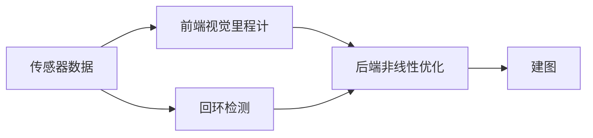

# 第二讲:初识slam

## SLAM要解决的问题

- 定位
- 建图

## 视觉SLAM所用的相机

- 单目相机
- 双目相机
- 深度相机

1. 单目相机

	只是用一个摄像头的相机. 例如我们生活中的照片. 它以二维的形式展示三维的世界. 在这个过程中丢掉了一个`深度`维度. 然而这个丢掉的信息是SLAM中的重要信息. 在这种情况下,无法确定物体的真实物体大小.另一方面,近处的物体移动速度快,远处的物体移动速度慢. 当相机运动时,这些物体在图像运动上形成了 **视差**. 

	**尺度的不确定性**: 单目相机无法凭照片确定真实尺度.

2. 双目相机和深度相机

	双目相机: 通过左右眼的差异判断场景中物体与相机之间的距离.

	深度相机: 主动向物体发射光并接受返回的光测出物体与相机之间的距离 .

## 经典的SLAM框架



- 传感器数据: 主要为相机的图像信息的读取和预处理.
- 视觉里程计: 估算相邻图像间相机的运动,以及局部地图的样子.
- 后端优化: 接受不同时刻视觉里程计测量的相机的位姿,以及回环检测信息,并对他们进行优化得到全局一致的轨迹和地图.
- 回环检测: 回环检测判断机器人是否到达过先前的位置.
- 建图: 根据估计的轨迹建立与任务要求对应的地图.

**如果工作环境限定在静态,刚体,光照变化不明显,没有认为干扰的场景**

### 视觉里程计

视觉里程(VO)计关心相邻两张图像之间的相机运动. `VO`能够通过相邻帧间的图像估计相机运动,并恢复场景的空间结构.

之所以称为里程计是因为它只计算相邻时刻的运动.

只要吧相邻时刻的运动串连起来,就构成了机器人的运动轨迹,从而决绝了定位问题. 另一方面我们根据每个时刻的相机位,计算出各个像素对应的空间点的位置,就得到了地图.

**累计漂移** : 视觉里程计只估计相邻图像间的运动,那么出现的误差将会传递下去,形成大的误差,称为累计漂移.

为了解决`漂移`问题,提出两种决绝方法:`后端优化`和`回环检测` .回环检测负责把机器人`回到原始位置`这件事情检测出来,后端优化是根据该信息矫正整个轨迹的形状.


### 后端优化

后端优化要考虑的问题是如何从带有噪声的数据中估计整个系统的状态,以及这个状态估计的不确定性有多大--这称为最大后验概率估计. 这里的状态既包含了机器人自身的轨迹 也包含了地图.

在SLAM框架中,前端给后端提供待优化数据,以及这些数据的初始值. 而后端负责整体的优化过程, 它往往面对的只有数据,不必关系这些数据到底来自哪个传感器.

在视觉SLAM中前端和计算机视觉领域研究更为相关,比如图像的特征提取与匹配,后端主要是滤波与非线性优化.

### 回环检测

回环检查又称为闭环检测,主要解决位置随时间漂移问题.地图存在的主要意义是让机器人知道自己到过的地方. 为了实现回环检测,我们需要让机器人具有识别自己到过的场景的能力.如果回环检测成功,可以显著减少累计误差.

### 建图

建图是指构建地图的过程.

地图大体可分为:

- 度量地图
- 拓扑地图

1. 度量地图

度量地图强调精确表示地图中物体的位置 关系,通常用稀疏与稠密进行分类. 稀疏地图进行了一定程度的抽象,并不需要表达所有物体. 稠密地图着重于建模所看到的所有东西. 对于定位来说,稀疏路标就足够了,而用于导航时,往往需要稠密地图.

2. 拓扑地图

相比较于度量地图的精确性,拓扑地图则强调元素之间的关系. 例如A,B点是联通的,而不考虑如何从A点到B点.

## SLAM问题的数学表达式

我们要使用数学表达式描述两个概念:

- 运动
- 观测

1. 运动

	通常,机器人会携带一个测量自身运动的传感器,比如说码盘或者惯性传感器. 无论什么传感器都可以使用一个通用的数学模型:

	$$ x_k = f(x_{k-1},u_k,w_k)$$

	该公式表示从$k-1$时刻到$k$时刻机器人位置的变化. $u_k$是运动传感器的读数(输入),$w_k$为噪声. 将此方差称为 **运动方程**

2. 观测

	**观测方程**如下:
	
	$$z_{k,j}=h(y_j,x_k,v_{k,j})$$
	
	$x_k$表示位置,$y_j$表示路标点,$v_{k,j}表示噪声. $z_{k,j}$表示机器人在位置$x_k$上相对与路标点$y_j$的相对信息(例如距离和方向角). 

	根据真实的运动和传感器的类型不同存在若干种量化方式,举例如下:

	位姿(位置和姿势)由两个位置参数和转角来描述, 即: $x_k=[x,y,\theta]_k^T$, 同时,运动传感器任意时间间隔位置和转角的变化量: $u_k = [\Delta x,\Delta y, \Delta \theta]_k^T$, 于是,运动方程如下:

	$$
	\begin{bmatrix}
		x\\y\\ \theta
	\end{bmatrix}
	_k
	= 
	\begin{bmatrix}
		x\\y\\ \theta 
	\end{bmatrix}
	_{k-1}
	+
	\begin{bmatrix}
		\Delta x \\ \Delta y \\ \Delta \theta
	\end{bmatrix}
	_k
	+
	w_k
	$$
	

SLAM过程可以总结为两个基本方程:

$$

\begin{cases}
	x_k = f(x_{k-1},u_k,w_k) \\
	z_{K,J} = h(y_j,x_k,v_{k,j})
\end{cases}

$$


根据噪声是否服从高斯分布进行分类, 分为 **线性/非线性和高斯/非高斯系统**

其中`线性高斯系统`是最简单的,它无偏的最优估计可以由卡尔曼滤波器给出.

而在复杂的`非线性非高斯系统`中使用 **扩展卡尔曼滤波器** 和 **非线性优化** 两大方法类去 求解.

目前主流视觉SLAM使用以`图优化`为代表的优化技术进行状态估计. 优化技术已经明显优于滤波技术,只要计算资源允许,通常都偏向于使用优化方法.

## 实践:编程基础

### 安装Linux操作系统

本书中选择了主流的Linux发行版Ubuntu系统.

### cmake

CMakeLists.txt文件的格式如下:

```CMakeLists
# 申明要求的cmake最低版本
cmake_minimum_required(VERSION 2.8)

# 声明一个cmake工程
project(HelloSLAM)

# 添加一个可执行程序
# 语法: add_executable(程序名 源代码文件)
add_executable(helloSLAM helloSLAM.cpp)
```


### 使用库

只有带有main函数的文件才会被编译成可执行程序, 而另一些代码我们只希望打包成一个东西, 供给其他程序调用.这个程序叫做库.

以下为如何用cmake生成库:

假如我们有一个`libHelloSLAM.cpp`文件要生成库.

CMakeLists 的内容如下:

```
add_library(hello libHelloSLAM.cpp)
```

编辑完成后,使用cmake编译工程,将会得到`libhello.a`文件.

>在linux中, 库文件分为`静态库`和`共享库`. 静态库以`.a`结尾,`共享库`以`.so`结尾.差别在于,静态库每次调用都会产生一个副本,而共享库只有一个副本,更省空间.

如果想要生成共享库而不是静态库:

```
add_library(hello_shared SHARED libHelloSLAM.cpp)
```

对于库我们要提供`头文件`, 说明这些库里都有什么. 对于使用者**只要拿到了`头文件`和`库文件`就可以使用库了**

以下为`libHello`的头文件:

```c++
#ifndef LIBHELLOSLAM_H_
#define LIBHELLOSLAM_H_

void printHello();

#endif
```
现在来调用库`useHello.cpp`:

```c++
#include "libHelloSLAM.h"

int main(int argc, char const *argv[])
{
	printHello();
	return 0;
}
```

完整的cmake文件为:

```
# 申明要求的cmake最低版本
cmake_minimum_required(VERSION 2.8)

# 声明一个cmake工程
project(HelloSLAM)

# 添加一个可执行程序
# 语法: add_executable(程序名 源代码文件)
add_executable(useHello useHello.cpp)
add_library(hello_shared SHARED libHelloSLAM.cpp)

# 将可执行文件useHello链接到hello_shared共享库上
target_link_libraries(useHello hello_shared)

```


