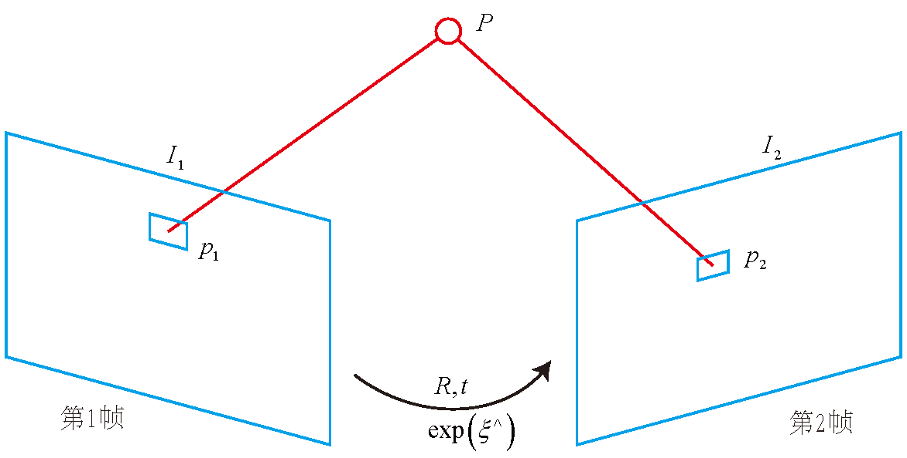

# 视觉里程计2

学习目标:

1. 理解`光流法`跟踪特征点的原理.
2. 理解`直接法`是如何估计相机的位姿
3. 使用g2o进行直接法计算

直接法是视觉里程计另一个主要分支,与特征点法有很大不同. 

## 直接法的引出

特征点法的缺点:
1. 关键点的提取与描述子的计算非常耗时.
2. 使用特征点时,忽略了除了特征点以外的所有信息.
3. 相机有时会运动到 **特征缺失**的地方.

克服特征点法缺点的办法:

- 保留特征点,但只计算关键点,不计算描述子.同时,使用 **光流法** 来跟踪特征点的运动. 
- 只计算关键点,不计算描述子.同时, 使用 **直接法** 来计算特征 点在下一个时刻图像中的位置.
- 既不计算关键点,也不计算描述子,而是根据灰度的差异, **直接**计算相机的运动.

直接法根据像素的亮度信息估计相机的运动,可以完全不用计算关键点和描述子,于是既避免了特征的计算时间,也避免了特征缺失的情况.

根据场景中使用像素的数量,直接法分为稀疏,稠密,半稠密三种.

## 光流(Optical Flow)

直接法是从光流演变而来.光流描述了像素在图像中的运动,而直接法则附带了一个相机的运动模型.

**光流:**是一种描述像素随时间在图像之间运动的方法.随着时间的流逝,同一个像素点会在图像中运动,而我们希望追踪它的运动过程.

- **稀疏光流:** 计算部分像素运动.(代表:Lucas-Kanade,LK)
- **稠密光流:** 计算所有像素.

**Lucas-Kanade 光流**
 
在LK光流中, 我们认为来自相机的图像是随着时间变化的. 那么图像可以看着时间函数:$I(t)$. 在t时刻,位(x,y)的像素的灰度可以写成:
$$
I(x,y,t)
$$

它的值域是图像中的像素灰度.

**灰度不变假设:** 同一个空间点的像素灰度值,在各个图像中不是固定不变的.

于是有:
$$
I(x+dx,y+dy,t+dt)=I(x,y,t)
$$

灰度不变假设在实际中往往不成立. 

对左边进行泰勒展开并保留一阶项:
$$
I(x+dx,y+dy,t+dt) \approx I(x,y,t) + \frac{\partial I}{\partial x}dx +\frac{\partial I}{\partial y}dy + \frac{\partial I}{\partial t} dt
$$

因为假设了灰度不变,所以:
$$
\frac{\partial I}{\partial x}dx +\frac{\partial I}{\partial y}dy + \frac{\partial I}{\partial t} dt = 0
$$

两边除以$dt$得:
$$
\frac{\partial I}{\partial x} \frac{dx}{dt} +\frac{\partial I}{\partial y}\frac{dy}{dt} = - \frac{\partial I}{\partial t}
$$

$\frac{dx}{dt}$为像素在x轴上的运动速度.
$\frac{dy}{dt}$为y轴上的速度.
把它们记做$u,v$

$\frac{\partial I}{\partial x}$表示图像在该点处x方向的梯度,同理可以y方向梯度,把它们记做$I_x,I_y$

$\frac{\partial I}{t}$表示图像灰度随时间变化,记做$I_t$

$$
\begin{bmatrix}
	I_x & T_y
\end{bmatrix}
\begin{bmatrix}
	u \\ v
\end{bmatrix}= - \bm{I_t}
$$

仅仅根据上式是无法计算出$u,v$的. 所以必须引入额外的约束来计算$u,v$. 

在LK光流中,假设 **某一个窗口内的像素具有相同的运动**

假设有一个大小为$w\times w$的窗口,它包含$w^2$个像素.这写个像素具有相同的运动,于是我们可得到$w^2$个方程.
$$
\begin{bmatrix}
	I_x & I_y
\end{bmatrix}_k
\begin{bmatrix}
	u & v
\end{bmatrix} =
-I_{tk}, \quad k=1,\cdots,w^2
$$

记:
$$
A=
\begin{bmatrix}
	[I_x,I_y]_1 \\
	\vdots \\
	[I_x,I_y]_k
\end{bmatrix}, \quad
b = 
\begin{bmatrix}
	I_{t1} \\
	\vdots \\
	I_{tk}
\end{bmatrix}
$$

于是可得:
$$
A
\begin{bmatrix}
	u \\v 
\end{bmatrix} = -b
$$

这是一个关于$u,v$的 $超定线性方程$,传统解法是求最小二乘解:
$$
\begin{bmatrix}
	u \\ v
\end{bmatrix}^* = -(A^TA)^{-1}A^Tb
$$

>当t取离散值,我们可以估计某块像素在若干图像中出现的位置

>在SLAM中,LK光流常被用来跟踪角点的运动.

## 实践:LK光流

### 使用TUM公开数据集

利用OpenCV提供的光流法来跟踪特征点. 

数据集见:`https://vision.in.tum.de/data/datasets/rgbd-dataset/download`

### 使用LK光流

代码见`code/第八讲`

## 直接法

直接法与光流法有一定的相似性.

### 直接法推导

考虑到某个空间点P和两个时刻的相机,P的世界坐标为$[X,Y,Z]$,它在两个相机上成像的非齐次坐标记做:$p_1,p_2$.

目标:求第一个相机到第二个相机的相对位姿变换.

设:旋转和平以为:$R,t$,两个相机的内参相同,记为$K$.投影方程:
$$
p_1 = \begin{bmatrix}
	u \\ v \\ 1
\end{bmatrix}_1 = \frac{1}{Z_1}KP, \qquad
p_2 = 
\begin{bmatrix}
	u \\ v \\ 1
\end{bmatrix}_2 = \frac{1}{Z_2}K(RP+t)=\frac{1}{Z_2}K(\exp(\xi^\wedge)P)_{1:3}
$$

直接法的思路是:根据当前相机的位姿的估计值来寻找$p_2$的位置. 如果相机的位姿不够好,$p_2$的外观和$p_1$会有明显的差别. 于是为了减小误差,我们优化相机的位姿,来寻找与$p_1$更相似的$p_2$.这样可以通过一个优化问题来完成,此时最小化的不是重投影误差,而是 **光度误差**,即:P的两个像素点的亮度误差:
$$
e=I_1(p_1)-I_2(p_2)
$$

优化目标为该误差的二范数:
$$
\min_\xi J(\xi)= \|e\|^2
$$

>以上任然基于 $灰度不变假设$

假设有许多个空间点$p_i$,那么，整个相机的位姿估计为：
$$
\min_\xi J(\xi) = \sum_{i=1}^N e_i^Te_i, \qquad e_i = I_1(p_1,i)-I_2(p_2,i)
$$

优化变量是相机的位姿$\xi$.需要知道误差e是如何随着相机位姿$\xi$变化的,所以需要分析它们的导数关系.

...

可以推导出误差相对于李代数的雅可比矩阵:
$$
\bm{J} = - \frac{\partial I_2}{\partial u}\frac{\partial u}{\partial \delta\xi}
$$

其中:
$$
u=\frac{1}{Z_2}Kq \newline
\frac{\partial u}{\partial \delta\xi} =
\begin{bmatrix}
	\frac{f_x}{Z} & 0 & -\frac{f_xX}{Z^2} & -\frac{f_xXY}{Z^2} & f_x+\frac{f_xX^2}{Z_2} & -\frac{f_xY}{Z} \\
	0 & \frac{f_y}{Z} & -\frac{f_yY}{Z^2} & -f_y-\frac{f_yY^2}{Z^2} & \frac{f_yXY}{Z^2} & \frac{f_yX}{Z}
\end{bmatrix}
$$

> 对于N个点的问题,可以中这种方法计算优化问题的雅可比矩阵,然后使用高斯牛顿法或列文伯格-马夸尔特方法计算增量,迭代求解.

### 直接法讨论

P是一个已知位置的空间点.
根据P的来源,我们把直接法进行分类:
1. P来自于稀疏关键点. 称为:稀疏直接法. 使用数百过着上千个关键点.
2. P来自部分像素.称为:半稠密直接法. 如果像素的梯度为零,整项雅可比矩阵为0,不会对计算运动增量有任何贡献.所以考虑只使用带有梯度的像素点.
3. P为所有像素. 称为:稠密直接法. 需要计算所有的像素点,需要GPU加速.

## 实践:RGB-D 的直接法

### 稀疏直接法

本节考虑RGB-D上的稀疏直接法VO.

因为直接法最后等价于一个优化问题,因此可以使用g2o或Ceres这些优化库求解.

在使用g2o之前,需要把直接法抽象成一个图优化问题,它是有一下顶点和边组成:

1. 优化变量为一个相机位姿,因此需要一个位姿定点.
2. 误差项为单个像素的光度误差.

### 定义直接法的边

### 使用直接法估计相机的运动

### 半稠密直接法

### 直接法的讨论

相比于特征点法,直接法完全依靠优化来求解相机的位姿. 像素梯度引导着优化方向,想要得到正确的优化结果,就必须保证 **大部分像素能够把优化引导到正确的方向上**

只有当相机运动很小, 图像中的梯度不会有很强的非凸性时, 直接法才成立.

单个像素没有什么区分性,所以通常会使用图像块,并且使用复杂的差异度量方式,例如归一化相关性.

### 直接法优缺点总结

优点:

1. 可以省去计算特征点,描述子的时间.
2. 只要求有像素梯度即可,不需要特征点. 因此,直接法可以在特征缺失的场合使用. 
3. 可以构建版稠密乃至稠密地图,这是特征点无法做到的.

缺点:

1. **非凸性**. 直接法完全依赖梯度搜索,降低目标函数来计算相机位姿.
2. **单个像素没有区分度**. 要么计算图像块,要么计算复杂的相关性.
3. **灰度值不变是很强的假设**. 如果相机是自动曝光,那么它会该表图像的明暗.光照变化时也会出现这种情况.
   

